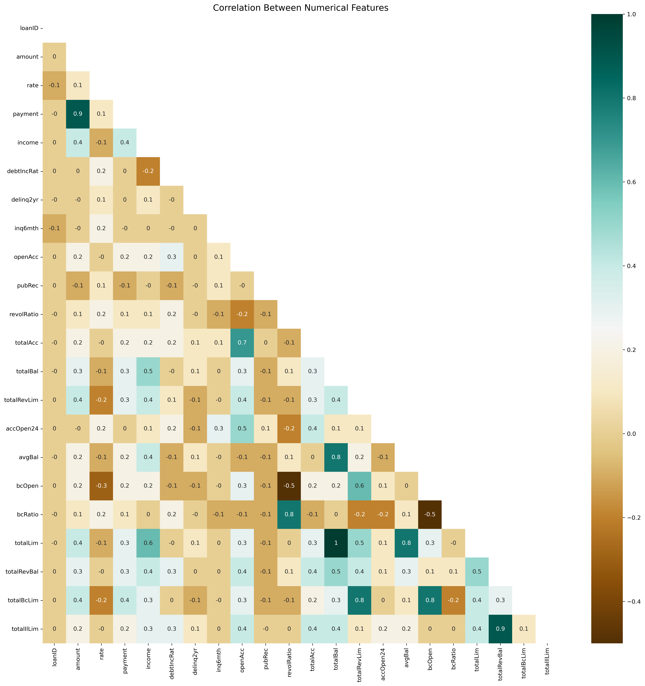
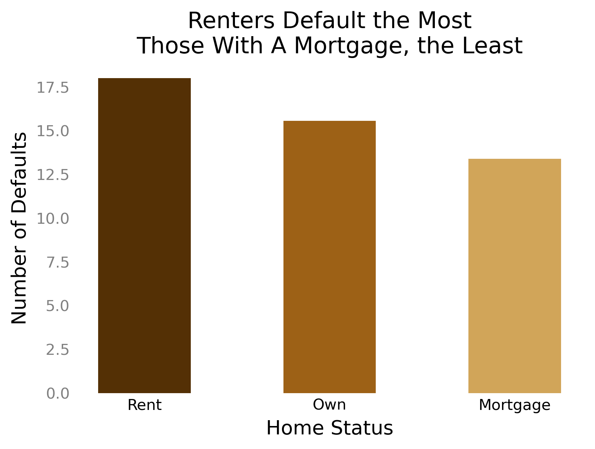
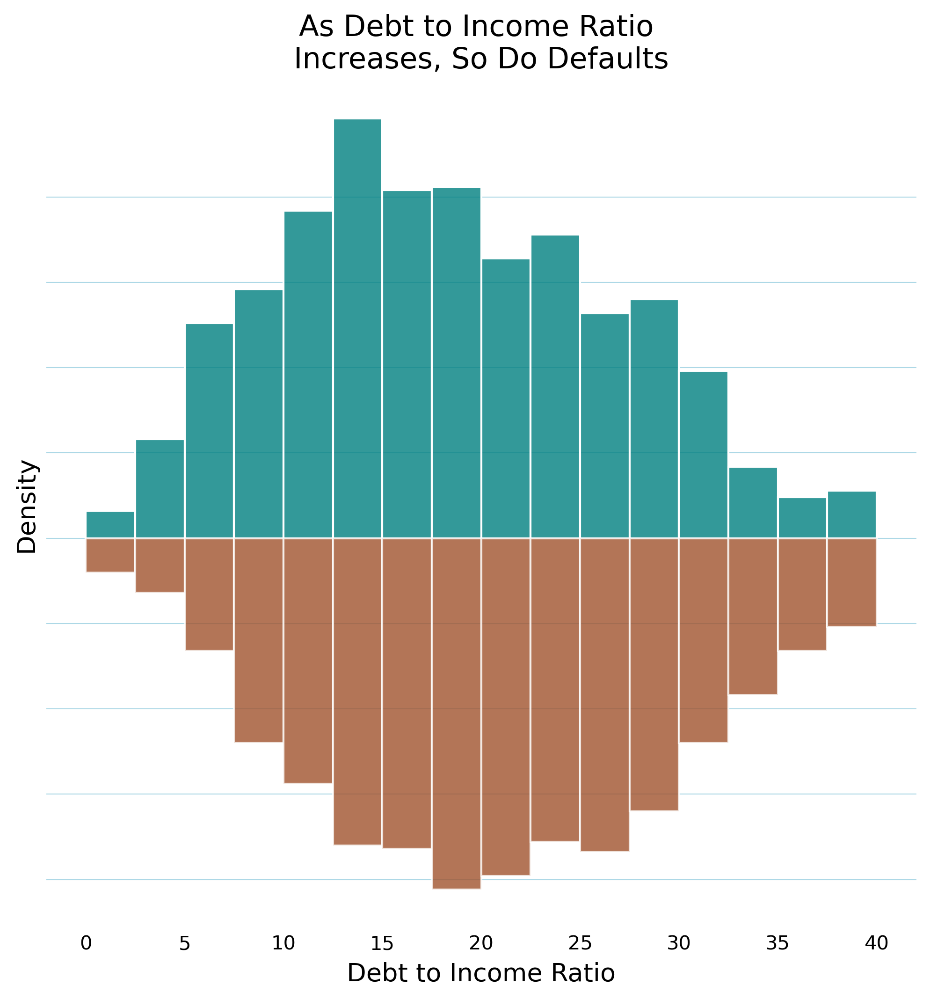

# Loan Default Prediction
## Project Report

### Project Overview: 

A bank has noticed that their loan defaults for personal loans is very high - nearly 15%. They want to use the data they have been collecting on the loans to try to predict which factors or features are most likely to indicate a high probability of loan default so they can deny those loans. 

#### Data Wrangling:

I started the project by familiarizing myself with the data. The original dataset had 32 features & 50,000 observations with about 25% of the features being categorical. 

Addressing Missing Values:  
* 1 loan had nulls for all features and was deleted. 

* For entries that were missing the value for length, but had a value for employment: I filled in length with the mean of '6 years'.  
* For entries with a missing value for employment, but a value for length: I filled in with '0 years'.  
* For the remaining that were missing both employment & length, I filled in with 'unemployed' & '0 years'.  
* I used the mean to fill in missing values for bcOpen, bcRatio and revolRatio. The mean looked like the best overall representation of the data. 

Looking at the data & checking outliers.  
* I checked how many states were represented.  49 total - all but Iowa. California had the most records.
* I noticed there were a few exceptionally high salaries so I checked those out. The ones below $3,000,000 made sense but the two above did not. Because I could not be certain what the error was with the salary, I deleted those two entries.
* I reviewed the remaining features for outliers or any data that appeared to not make sense. Some were much higher than others but they seemed plausible still so I kept them with one exception, see below. 
* Record 22161 looks to be very suspicious. The totalRevLim and totalLim are inconsistent with the rest of their data. I have opted to delete this record.

Creating “Default” & “Current Categories” for “Status” Feature
* I wanted to pare down the different status categories. Next I wanted to look at the different status categories. For the purpose of looking for defaults, I grouped the 7 categories into 3: Current, Late & Default. Since the goal is to predict either Default or Current, I opted to remove all observations in the 'Late' status. Fortunately, this was only 1.6% of the total remaining observations.

Post cleaning: 49184 observations (no features have been removed yet).

#### Exploratory Data Analysis:

* I noticed some inconsistencies in the ‘Verified’ feature so I corrected them. It is important that the entries align so that there are not extra, unnecessary features created later on when encoding the data. Some entries were listed as “Source Verified” and some were simply “Verified”. 

Additional Features Dropped

* Next I wanted to check what correlations exist in the data. Since there was a 99% correlation between ‘totalBal’ and ‘totalLim’, I removed the totalLim 
feature as it doesn't provide 
additional information.

I wanted to see if ‘employment’ could be used as a predictor. There are over 18,000 unique professions. I looked at grouping professions but there were too many gray areas. In the end, it's too much to figure out so I dropped the feature. I still have (employment) length so I am able to capture some of a related feature still.

I separated the features and target variable. I used chi-squared testing to identify the most significant features that are strongly associated with the target variable. It looks like term length might be useful for feature prediction.

I was curious about a possible relationship between loan status and Debt to Income Ratio. Looks like it is a slightly higher trend for those who default.

I wanted to see if there was a difference in defaults based on home ownership. To do this, I created a new dataframe showing the percentage of defaults for each category of home status. I was surprised to see that those who own their homes outright were in the middle. I expected them to default the least.

I wanted to try the same experiment with the reason for the loan. I speculated that debt consolidation would be the feature with the highest percentage of defaults. Turns out, Small Business loans were highest. Debt Consolidation was the most common reason for loans, followed by Credit Cards. These are pretty similar reasons and it could be argued that joining them would make sense. If joined, together they would account for the highest amount of defaults. I created a separate drataframe and calculated the percentage of defaults per loan reason.

I separated Current & Default and created samples of 1000 from each for easier visualization. I did a quick histogram of the separated dataframes to compare to each other. Most of the distributions have very distinct right tails showing outliers in the data. 

I tried using describe on each of the newly created dataframes and then subtracted them from each other to see if there were any large differences. Because the data is scaled very differently, it was hard to easily see what differences might be important. And beyond that, because the data is not normally distributed, these metrics are not as helpful.

I looked at why people were getting a loan vs. their income. I used loan status to further separate the data on the plot.

I wanted to sort the defaults by state to see if any states in particular had a higher percentage of defaults. I decided to regroup the states by quartiles. This can be helpful during preprocessing when categorical features are encoded. 

A quick glance at the states with high defaults made me curious what the correlation was with math scores in that state. I was able to find a dataset with math scores by state so I cleaned it and merged it with the State Summary dataframe. Not particularly useful but it is interesting nonetheless.

I tried another scatter plot to look for any patterns in the data. I plotted the Total Number of Credit Lines against the Debt to Income Ratio.

I used a histogram to plot the number of records across the debtIncRat (debt to income ratio). By splitting Default & Current, I'm able to see a trend of where current loans outnumber defaults at the lower debtIncRat and then defaults outnumber currents at the high debIncRat. It's hard to see so I tried to mirror the plot.

#### Pre-processing:

Before encoding, I mapped the length feature to preserve the order of the data. I split the data into a target variable and predictive features and used dummy encoding to transform categorical features to numeric. Next I split the data into a training set and a testing set and scaled the data (using Standard Scaler).

#### Modeling:

I decided to try out four algorithms that handle classification problems well: Logistic Regression, Random Forest Classifier, Gradient Boosting Classifier and Support Vector Machines (SVM). I looked for the best Recall Score because recall measures the proportion of actual defaults that were correctly identified by the model. In the context of loan default prediction, it is important to identify as many defaults as possible to minimize the risk of losses for the lender. Therefore, optimizing for recall can help ensure that the model is effective at identifying defaulters. Linear Regression and SVM were close to each other but Linear Regression had a better recall score.

The Linear Regression model also had a significantly faster run time. 

I wanted to see if I could get better results from my model by addressing the class imbalance with different sampling techniques so I tried synthetic oversampling, random oversampling and random undersampling. I then tested the results again using Logistic Regression.

I moved forward with SMOTE synthetic oversampling to tune my hyperparameters. It had the highest scores in all metrics except accuracy which I am less concerned about.

#### Summary:

I wanted to see which features made the biggest impact on the model so I plotted the coefficients. Loan term (60 months) being the highest categorical features wasn’t a surprise as it scored the highest previously when I performed a chi-squared test. I was a bit surprised to see State - Quantile 1 as State had a low chi-squared test score; however, I think the splitting the states into quartiles made a big difference. 

I narrowed down to the top 8 to see which features the model was utilizing the most to make predictions. 

#### Conclusion:

Ultimately the results were below expectations. The model makes far too many mistakes with both false positives and false negatives. 

A false negative (Type II error) means the model incorrectly classified a loan as paid on time when it should have been classified as a default. They can have significant consequences in the case of loan default prediction because they can lead to the approval of credit to individuals that eventually default on their loans. This can result in financial losses for the lender, damage to credit scores for the borrowers, and potential legal consequences.

In the case of loan default prediction, a false positive means the model incorrectly classified a loan as a default when it should have been classified as paid on time. False positives (Type I errors) can lead to the denial of credit to individuals that would have otherwise paid their loans on time. This can result in lost opportunities for both the borrower and the lender.

Therefore, it is important to minimize false positives while building a loan default prediction model to avoid rejecting good loans or customers who are unlikely to default. To achieve a successful model that could be implemented, additional features are needed. Below is a sample of what features are not included that could be useful. 

* Additional Borrower information: 
Credit score, Age, Education level, Marital status, Number of dependents, Geography (city or area code instead of just state)
* Additional Loan characteristics:
Interest rate type (fixed or variable), Type of loan (secured or unsecured), Loan origination date, payment frequency
* Economic factors:
Interest rates, Inflation rate, Unemployment rate, GDP growth rate

